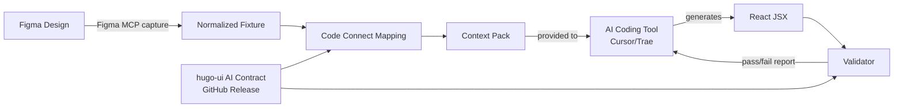

# design-contract-mcp

A **contract-first Figma-to-Code MCP Server** that bridges Figma designs to production-ready React code by consuming versioned design-system AI Contracts. It works as an MCP extension for AI coding tools (Cursor, Trae, etc.), providing design context resolution and generated code validation — ensuring AI-generated React code stays compliant with the design system.

- **Repository**: [HugoHZXu/design-contract-mcp](https://github.com/HugoHZXu/design-contract-mcp)
- **Tech Stack**: TypeScript · Node.js · MCP (Model Context Protocol) · tsx

> ⚠️ Architecture demo, not a production Figma-to-code tool. It demonstrates the full contract-first Figma-to-Code pipeline: capturing Figma design data → mapping to design system components → building generation context → validating AI-generated React code against the design system contract.

## What It Does

The MCP server exposes tools that an AI coding client calls during the Figma-to-Code workflow:

1. **Normalize** — captured Figma MCP tool output into a compact local design fixture
2. **Resolve** — node-to-component mappings from `code-connect/manifest.json` (Figma component ID → `@hugo-ui/mui` component)
3. **Load** — component contracts and token policies from a verified `@hugo-ui/mui` AI Contract artifact
4. **Build** — a context pack combining design data, mapping metadata, contracts, tokens, pattern rules, and expected component usage — this is what the AI model uses to generate code
5. **Validate** — generated React code against import packages, allowed props, forbidden props, mapped component coverage, and raw color literals
6. **Return** — structured validation reports back to the MCP client

> 💡 The MCP server focuses on **context resolution and validation only**. Code generation itself happens in the calling AI tool (Cursor, Trae, etc.), not inside this server.

## Pipeline Architecture



## MCP Tools Exposed

| Tool | Purpose |
|---|---|
| `get_design_context(frameId)` | Fetch normalized design data for a Figma frame |
| `get_code_connect_map(nodeId)` | Resolve Figma node → design system component mappings |
| `get_component_contract(componentName, contractVersion?)` | Load a specific component's contract (props, tokens, rules) |
| `build_generation_context(frameId, contractVersion?)` | Build the full context pack for AI code generation |
| `validate_generated_code(code, expectedComponentUsage, contractVersion?)` | Validate generated React against the contract |
| `get_contract_status()` | Check which contract version is active |

## MCP Server Transports

| Transport | Command | Default Port |
|---|---|---|
| stdio | `npm run mcp:server` | Inter-process (for local MCP clients) |
| Streamable HTTP | `npm run mcp:http` | `127.0.0.1:3000` |
| Node HTTPS (direct TLS) | `npm run mcp:https` | `127.0.0.1:3443` |

## Validation Scope

The validator checks AI-generated React code for:

- Correct import packages (components must be imported from contract-specified packages)
- Allowed props only (JSX props must be in the component contract)
- Forbidden prop usage
- Mapped component coverage (all expected design components must appear in JSX)
- Raw color literals (`#FF0000`, `rgb(...)`, `hsl(...)`) — enforcing token-based styling

## Contract Version Management

The server can resolve `@hugo-ui/mui` AI Contract artifacts from:
- **Vendor fallback** — a reproducible snapshot committed in `vendor/hugo-ui/mui-ai-contract/`
- **GitHub Releases** — sync versioned artifacts with SHA256 verification via `npm run contract:sync:hugo-ui`
- **Local cache** — `.cache/hugo-ui/mui-ai-contract/<version>/`

## Project Structure

```
mcp-server/         MCP server core (stdio/HTTP/HTTPS entries, adapter, CLI, validator)
code-connect/       Contract-enriched Figma node → component mapping
fixtures/figma/     Captured + normalized Figma design data (Edit Profile Modal demo)
vendor/             Vendored @hugo-ui/mui AI contract fallback snapshot
contracts/patterns/ Page-level pattern contracts
scripts/            Figma fixture normalization, contract sync/verify CLI
generated/          Context pack, sample React code, validation reports
```

## Relationship with hugo-ui

This is the **consumer side** of a two-repository Figma-to-Code workflow:

- [hugo-ui](./ui) owns the design-system source and publishes `@hugo-ui/mui` AI Contract artifacts (component props, token policies, generation rules) through GitHub Releases
- design-contract-mcp resolves Figma design data, maps nodes to design-system components, builds generation context for AI, and validates the generated React code
