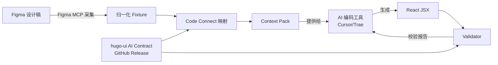

# design-contract-mcp

**Contract-first 的 Figma-to-Code MCP Server**，通过消费版本化的设计系统 AI Contract，将 Figma 设计稿转化为符合设计系统规范的 React 代码。作为 AI 编码工具（Cursor、Trae 等）的 MCP 扩展，提供设计上下文解析和生成代码校验能力——确保 AI 生成的 React 代码符合设计系统约束。

- **仓库**：[HugoHZXu/design-contract-mcp](https://github.com/HugoHZXu/design-contract-mcp)
- **技术栈**：TypeScript · Node.js · MCP (Model Context Protocol) · tsx

> ⚠️ 架构 Demo 项目，非生产级 Figma-to-Code 工具。展示完整的 Contract-first Figma-to-Code 链路：采集 Figma 设计数据 → 映射到设计系统组件 → 构建生成上下文 → 校验 AI 生成的 React 代码是否符合设计系统 Contract。

## 核心流程

MCP Server 暴露一系列 Tools，供 AI 编码客户端在 Figma-to-Code 工作流中调用：

1. **Normalize** — 将 Figma MCP 工具输出归一化为紧凑的本地设计 fixture
2. **Resolve** — 从 `code-connect/manifest.json` 解析 Figma 节点到设计系统组件的映射（Figma 组件 ID → `@hugo-ui/mui` 组件）
3. **Load** — 从已校验的 `@hugo-ui/mui` AI Contract 产物加载组件 Contract 和 Token 策略
4. **Build** — 构建上下文包（context pack），组合设计数据、映射元数据、Contract、Token、模式规则、预期组件用法——这是 AI 模型用来生成代码的上下文
5. **Validate** — 校验生成的 React 代码：import 包、允许 props、禁止 props、映射组件覆盖率、原始颜色字面量
6. **Return** — 返回结构化校验报告给 MCP 客户端

> 💡 MCP Server 只负责**上下文解析和代码校验**，代码生成本身由调用方的 AI 编码工具（Cursor、Trae 等）完成，Server 不做代码生成。

## Pipeline 架构



## 暴露的 MCP Tools

| Tool | 用途 |
|---|---|
| `get_design_context(frameId)` | 获取 Figma frame 的归一化设计数据 |
| `get_code_connect_map(nodeId)` | 解析 Figma 节点到设计系统组件的映射 |
| `get_component_contract(componentName, contractVersion?)` | 加载指定组件的 Contract（props、tokens、规则） |
| `build_generation_context(frameId, contractVersion?)` | 构建 AI 代码生成所需的完整上下文包 |
| `validate_generated_code(code, expectedComponentUsage, contractVersion?)` | 校验生成的 React 代码是否符合 Contract |
| `get_contract_status()` | 查看当前激活的 Contract 版本 |

## MCP Server 传输模式

| 模式 | 启动命令 | 默认端口 |
|---|---|---|
| stdio | `npm run mcp:server` | 进程间通信（本地 MCP 客户端） |
| Streamable HTTP | `npm run mcp:http` | `127.0.0.1:3000` |
| Node HTTPS (直连 TLS) | `npm run mcp:https` | `127.0.0.1:3443` |

## 校验范围

Validator 对 AI 生成的 React 代码做以下检查：

- Import 包是否正确（组件必须从 Contract 指定的包导入）
- Props 是否均在组件 Contract 的允许列表中
- 禁止使用的 props
- 映射组件覆盖率（JSX 中是否覆盖了所有预期的设计组件）
- 原始颜色字面量（`#FF0000`、`rgb(...)`、`hsl(...)`）——强制使用 Token 化样式

## Contract 版本管理

Server 可以从以下来源解析 `@hugo-ui/mui` AI Contract：
- **Vendor fallback** — 仓库内置的可重现快照 `vendor/hugo-ui/mui-ai-contract/`
- **GitHub Releases** — 通过 `npm run contract:sync:hugo-ui` 同步带 SHA256 校验的版本化产物
- **本地缓存** — `.cache/hugo-ui/mui-ai-contract/<version>/`

## 项目结构

```
mcp-server/         MCP Server 核心（stdio/HTTP/HTTPS 入口、adapter、CLI、validator）
code-connect/       Contract 增强的 Figma 节点→组件映射
fixtures/figma/     采集+归一化的 Figma 设计数据（Edit Profile Modal 示例）
vendor/             内置的 @hugo-ui/mui AI Contract fallback 快照
contracts/patterns/ 页面级 pattern contract
scripts/            Figma fixture 归一化、Contract 同步/校验 CLI
generated/          Context pack、示例 React 代码、校验报告
```

## 与 hugo-ui 的关系

这是双仓库 Figma-to-Code 工作流的**消费端**：

- [hugo-ui](./ui) 拥有设计系统源码，通过 GitHub Releases 发布 `@hugo-ui/mui` AI Contract 产物（组件 props、Token 策略、生成规则）
- design-contract-mcp 解析 Figma 设计数据、映射节点到设计系统组件、为 AI 构建生成上下文、校验生成的 React 代码
